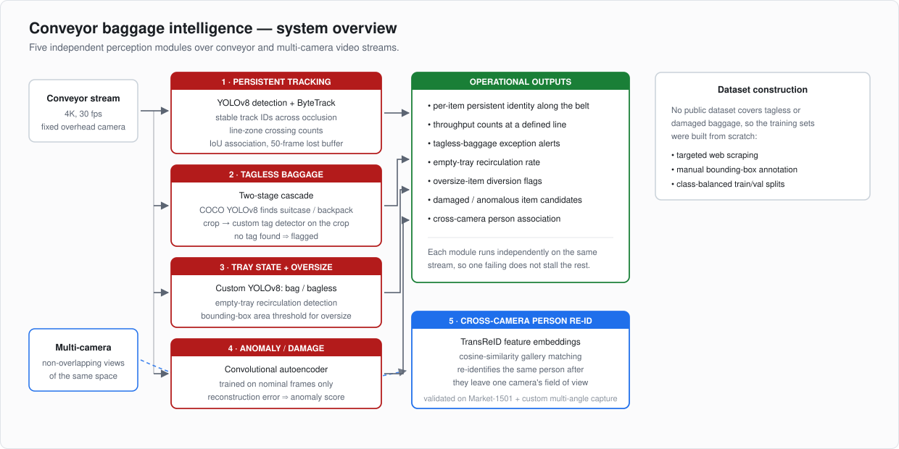

# Conveyor Baggage Intelligence — Tracking, Exception Detection & Person Re-ID

Real-time computer-vision pipeline for baggage handling on conveyor systems, built during a machine-learning internship at **Cooper Compass** (Nov 2024 – Jan 2025).

> **Status:** documentation only. This was client work — the source code, the trained weights and the operational video data are the company's property and are not published here. What follows is a technical description of what was built and why.

---

## The problem

A baggage-handling belt is a conveyor with a throughput target and a set of exceptions that cost money when missed: a bag with no tag cannot be routed, an empty tray circulating consumes capacity, an oversize item jams a sorter, a damaged bag becomes a claim. Traditionally these are caught by staff watching the line, which does not scale and does not produce data.

The goal was to catch all of them automatically from the camera feeds that already exist, and to do it without a single item losing its identity as it travels.

---

## 1 · Persistent tracking

Detection alone is not enough. A detector run frame-by-frame gives you a *count per frame*, not a bag — the same suitcase is a new object 900 times over 30 seconds.

**YOLOv8 detection paired with ByteTrack** assigns each item a persistent track ID that survives partial occlusion, which is constant on a loaded belt where bags overlap and pass under structures. ByteTrack's two-stage association — matching high-confidence detections first, then recovering low-confidence ones against surviving tracks — is what keeps an ID alive through the frames where a bag is half-hidden.

Tracking was tuned for the belt rather than left at defaults: a 50-frame lost-track buffer so an item occluded for over a second is recovered rather than re-issued, a minimum consecutive-frame threshold to suppress spurious tracks, and IoU-based association thresholds set for the overhead viewpoint.

A **line zone** across the belt converts tracks into throughput: each track crossing the line counts exactly once, in a direction, which is the number operations actually wants.

## 2 · Tagless baggage detection

The obvious approach — train one detector on "bag with tag" and "bag without tag" — works poorly. A baggage tag is small, it flutters, it is often turned away from the camera, and the visual difference between the two classes is a few dozen pixels on a large object.

The approach used instead is a **two-stage cascade**:

1. A COCO-pretrained YOLOv8 locates `suitcase` and `backpack` instances — a class it already knows well, so no training data is needed for this step.
2. Each detection is **cropped**, and a purpose-trained tag detector runs on the crop alone.

Because the second model sees only the bag, the tag occupies a far larger fraction of its input, and the detection problem becomes tractable. Absence of a tag above the confidence threshold flags the item as an exception.

The general lesson — that cropping to a region of interest before a fine-grained detection step converts a hard small-object problem into an easy one — transferred to several other modules.

## 3 · Tray state and oversize items

A purpose-trained YOLOv8 model classifies trays as `bag` or `bagless`, which surfaces empty-tray recirculation — trays going round the loop carrying nothing, consuming throughput invisibly.

Oversize detection is deliberately simple: bounding-box area against a calibrated threshold for the fixed camera geometry. A learned size classifier would have been more work with no better result, since with a fixed overhead camera at known height, pixel area *is* physical size.

## 4 · Damage and anomaly detection

Damaged baggage is a hard supervised problem because damage is rare, visually diverse and hard to collect. Rather than trying to enumerate damage classes, this module uses a **convolutional autoencoder trained only on nominal frames**. The network learns to reconstruct ordinary items well; anything unusual reconstructs poorly, and the reconstruction error becomes an anomaly score that surfaces candidates for review.

This inverts the data problem: instead of needing examples of every failure, it needs examples of normal — which the belt produces continuously.

## 5 · Cross-camera person re-identification

The final module answers a different question: is the person at camera B the same person who was at camera A? With non-overlapping fields of view there is no spatial continuity to exploit, so appearance has to carry the match.

**TransReID** generates deep feature embeddings per person detection; matching is done by **cosine similarity** against a gallery of embeddings from other cameras. A transformer-based Re-ID backbone was chosen over a CNN baseline for its robustness to viewpoint and pose change, which is the dominant failure mode when the same person is seen from different angles.

Validation ran against the **Market-1501** benchmark for comparability with published results, and against custom multi-angle video captured specifically to test the cross-camera case that Market-1501 does not fully represent.

---

## Dataset construction

No public dataset covers tagless baggage, damaged baggage or tray occupancy, so the training data was built from scratch: targeted web scraping to assemble candidate imagery, manual bounding-box annotation, and class-balanced train/validation splits.

This was a substantial share of the actual work, and it is the part that most determined final model quality.

## Stack

`PyTorch` · `YOLOv8 (Ultralytics)` · `ByteTrack` · `supervision` · `TransReID` · `OpenCV` · `NumPy`

## Related

The research-grade segmentation and regression work from my IIT Bombay internship is documented at [vapor-bubble-dynamics-ml](https://github.com/amoghshetty7436/vapor-bubble-dynamics-ml).
